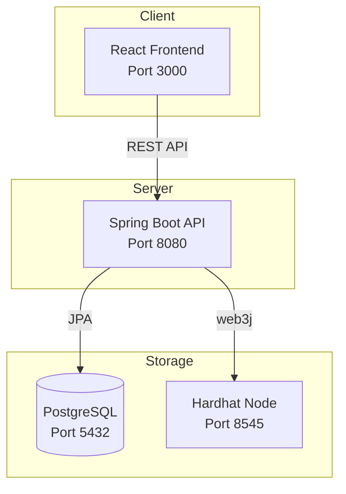
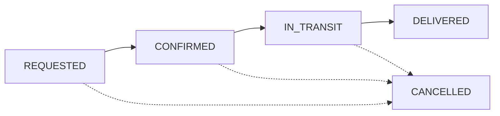

# Inventory Blockchain - Supply Chain Transfer Platform

A full-stack supply chain management system with blockchain verification, role-based access control, real-time notifications, and comprehensive analytics. Built with Spring Boot, React, PostgreSQL, and Ethereum smart contracts.


---

## 📋 Overview

This platform demonstrates a hybrid off-chain/on-chain architecture for enterprise supply chain management:

- **Off-chain (PostgreSQL)**: Stores complete transfer details, user data, optimized for queries
- **On-chain (Ethereum)**: Stores cryptographic proof (hash) for immutable audit trail
- **Role-Based Access**: 5-tier permission system for secure operations
- **Real-time Notifications**: Automatic alerts for transfer status changes
- **Comprehensive Analytics**: Charts, KPIs, and performance metrics

---

## 🗂️ Architecture



| Component | Technology | Port |
|-----------|------------|------|
| Frontend | React + Vite | 3000 |
| Backend | Spring Boot 3 | 8080 |
| Database | PostgreSQL | 5432 |
| Blockchain | Hardhat | 8545 |

---

## ✨ Features

### 🎨 Dual Theme System
- **Professional Theme**: Clean, minimalist dark mode for enterprise use
- **Vibrant Theme**: Colorful gradients with emoji icons for modern look
- Toggle between themes with smooth transitions

### 🔔 Real-time Notifications
- Bell icon with unread count badge
- Automatic notifications on transfer status changes
- Notification preferences (transfer updates, inventory alerts, order updates, system alerts)
- Mark as read / Mark all as read functionality

### 🔐 Role-Based Access Control

| Role | Access Level | Key Permissions |
|------|--------------|-----------------|
| **Admin** | Level 5 | Everything + User Management |
| **Warehouse Manager** | Level 4 | Create, Cancel, Approve, Update Status |
| **Logistics** | Level 3 | Update Delivery Status, View All |
| **Inventory Clerk** | Level 2 | Create Transfers, View Inventory & Reports |
| **Viewer** | Level 1 | View Inventory Only |

### 📊 Dashboard & Pages

| Page | Description | Features |
|------|-------------|----------|
| 📊 **Dashboard** | Overview with KPIs and quick actions | Stats cards, recent transfers, low stock alerts, activity feed, status distribution |
| 📦 **Transfers** | Transfer management | Create, status updates, blockchain verification, filtering |
| 📋 **Inventory** | Stock management | Search, filter by location/category, low stock indicators |
| 📈 **Reports** | Basic reporting | Stock value charts, transfer analytics |
| 🔍 **Audit** | Activity logging | User actions, entity changes, date filtering, export to CSV |
| 🏭 **Suppliers** | Supplier portal | Supplier management, purchase orders, ratings |
| 📊 **Analytics** | Advanced analytics | KPIs, donut charts, bar charts, performance metrics |
| 📁 **Documents** | Document management | Upload, categorize, search, SHA-256 hash verification |
| 👥 **Users** | User management | Create/edit users, assign roles, activate/deactivate |

### 📦 Transfer Status Workflow



---

## 📂 Project Structure

```
inventory-blockchain/
│
├── backend/
│   └── supply-chain-platform/
│       ├── pom.xml
│       └── src/main/java/com/inventory/blockchain/
│           ├── config/          # Web3, CORS configuration
│           ├── controller/      # REST endpoints
│           │   ├── TransferController.java
│           │   ├── UserController.java
│           │   ├── AuditController.java
│           │   ├── SupplierController.java
│           │   ├── AnalyticsController.java
│           │   ├── DocumentController.java
│           │   └── NotificationController.java
│           ├── dto/             # Request/Response objects
│           ├── entity/          # JPA entities
│           │   ├── Transfer.java
│           │   ├── User.java
│           │   ├── Role.java
│           │   ├── ActivityLog.java
│           │   ├── Supplier.java
│           │   ├── PurchaseOrder.java
│           │   ├── Document.java
│           │   ├── Notification.java
│           │   └── NotificationPreference.java
│           ├── repository/      # Data access
│           ├── service/         # Business logic
│           │   └── NotificationService.java
│           └── util/            # Hash utilities
│
├── frontend/
│   ├── package.json
│   ├── vite.config.js
│   └── src/
│       ├── App.jsx              # Main app with all pages
│       └── main.jsx
│
└── chain/
    ├── package.json
    ├── hardhat.config.js
    ├── contracts/
    │   └── TransferLedger.sol
    └── scripts/
        └── deploy.js
```

---

## 🚀 Quick Start

### Prerequisites

- Java 21 or later
- Maven 3.8+
- Node.js 18+ and npm
- PostgreSQL 14+

### Step 1: Clone the Repository

```bash
git clone https://github.com/Zag009/inventory-blockchain.git
cd inventory-blockchain
```

### Step 2: Database Setup

```bash
psql -U postgres -c "CREATE DATABASE inventory_db;"
```

Run the SQL schema files in pgAdmin:
1. `users-schema.sql` - Users and roles
2. `audit-schema.sql` - Activity logging
3. `suppliers-schema.sql` - Supplier portal
4. `document-schema.sql` - Document management
5. `notifications-schema.sql` - Notifications system

### Step 3: Start Blockchain (Terminal 1)

```bash
cd chain
npm install
npx hardhat node
```

### Step 4: Deploy Smart Contract (Terminal 2)

```bash
cd chain
npx hardhat run scripts/deploy.js --network localhost
```

### Step 5: Start Backend (Terminal 3)

```bash
cd backend/supply-chain-platform
mvn spring-boot:run
```

### Step 6: Start Frontend (Terminal 4)

```bash
cd frontend
npm install
npm run dev
```

### Step 7: Open Browser

Navigate to: **http://localhost:3000**

---

## 🔑 Demo Accounts

| Username | Password | Role | Access |
|----------|----------|------|--------|
| `admin` | `admin123` | Administrator | Full access |
| `admin2` | `admin123` | Administrator | Full access |
| `manager` | `manager123` | Warehouse Manager | Manage all |
| `logistics` | `logistics123` | Logistics | Update status |
| `clerk` | `clerk123` | Inventory Clerk | Create/View |
| `viewer` | `viewer123` | Viewer | View only |

---

## 📡 API Endpoints

### Transfers API

| Method | Endpoint | Description |
|--------|----------|-------------|
| `GET` | `/api/transfers` | List all transfers |
| `POST` | `/api/transfers` | Create new transfer |
| `GET` | `/api/transfers/{id}` | Get transfer by ID |
| `PUT` | `/api/transfers/{id}/status` | Update transfer status |

### Users API

| Method | Endpoint | Description |
|--------|----------|-------------|
| `GET` | `/api/users` | List all users |
| `POST` | `/api/users` | Create new user |
| `PUT` | `/api/users/{id}` | Update user |
| `DELETE` | `/api/users/{id}` | Delete user |

### Audit API

| Method | Endpoint | Description |
|--------|----------|-------------|
| `GET` | `/api/activity-logs` | List activity logs |
| `GET` | `/api/activity-logs/stats` | Get audit statistics |

### Suppliers API

| Method | Endpoint | Description |
|--------|----------|-------------|
| `GET` | `/api/suppliers` | List all suppliers |
| `POST` | `/api/suppliers` | Create supplier |
| `GET` | `/api/suppliers/orders` | List purchase orders |
| `POST` | `/api/suppliers/orders` | Create purchase order |

### Analytics API

| Method | Endpoint | Description |
|--------|----------|-------------|
| `GET` | `/api/analytics/kpis` | Get KPI metrics |
| `GET` | `/api/analytics/transfers/by-status` | Transfer breakdown |
| `GET` | `/api/analytics/transfers/daily` | Daily transfer volume |
| `GET` | `/api/analytics/performance` | Performance metrics |

### Documents API

| Method | Endpoint | Description |
|--------|----------|-------------|
| `GET` | `/api/documents` | List documents |
| `POST` | `/api/documents` | Upload document |
| `GET` | `/api/documents/categories` | Get categories |
| `GET` | `/api/documents/stats` | Document statistics |

### Notifications API

| Method | Endpoint | Description |
|--------|----------|-------------|
| `GET` | `/api/notifications/user/{id}` | Get user notifications |
| `GET` | `/api/notifications/user/{id}/count` | Get unread count |
| `PUT` | `/api/notifications/{id}/read` | Mark as read |
| `PUT` | `/api/notifications/user/{id}/read-all` | Mark all as read |
| `GET` | `/api/notifications/preferences/{id}` | Get preferences |
| `PUT` | `/api/notifications/preferences/{id}` | Update preferences |

---

## 🔒 Permission Matrix

| Action | Admin | Manager | Logistics | Clerk | Viewer |
|--------|:-----:|:-------:|:---------:|:-----:|:------:|
| Create Transfer | ✅ | ✅ | ❌ | ✅ | ❌ |
| Cancel Transfer | ✅ | ✅ | ❌ | ❌ | ❌ |
| Approve Transfer | ✅ | ✅ | ❌ | ❌ | ❌ |
| Update Status | ✅ | ✅ | ✅ | ❌ | ❌ |
| View Transfers | ✅ | ✅ | ✅ | ✅ | ❌ |
| View Inventory | ✅ | ✅ | ✅ | ✅ | ✅ |
| View Reports | ✅ | ✅ | ✅ | ✅ | ❌ |
| View Audit Logs | ✅ | ✅ | ✅ | ❌ | ❌ |
| Manage Suppliers | ✅ | ✅ | ❌ | ❌ | ❌ |
| Manage Documents | ✅ | ✅ | ✅ | ✅ | ❌ |
| Manage Users | ✅ | ❌ | ❌ | ❌ | ❌ |

---

## 🛠️ Tech Stack

### Frontend
- React 18
- Vite 5
- CSS-in-JS (inline styles)
- Custom SVG charts (no external chart library)

### Backend
- Spring Boot 3.3.5
- Java 21
- Maven
- Spring Data JPA

### Database
- PostgreSQL 14+

### Blockchain
- Ethereum
- Solidity 0.8.20
- Hardhat
- web3j 4.12.2

---

## 📸 Screenshots

### Dashboard
- Quick action buttons (New Transfer, Inventory, Suppliers, Reports)
- KPI cards (Total Transfers, Pending, In Transit, Delivered)
- Secondary stats (Inventory Items, Low Stock, Suppliers, Success Rate)
- Recent transfers list with status badges
- Low stock alerts panel
- Activity feed
- Transfer status distribution chart

### Theme Toggle
- Professional theme: Clean dark mode
- Vibrant theme: Colorful with gradients and emoji icons

### Notifications
- Bell icon with unread badge
- Dropdown panel with notification list
- Preferences panel for notification types
- Auto-notifications on transfer changes

### Analytics Dashboard
- KPI cards with icons
- Bar charts for transfer volume
- Donut charts for status distribution
- Location activity breakdown
- Top suppliers table
- Performance metrics

### Supplier Portal
- Supplier cards with ratings
- Purchase order management
- Order status workflow
- Supplier details modal

### Audit Module
- Activity log table
- Filter by user, action, entity type
- Date range filtering
- Export to CSV

---

## 📄 License

MIT License - Built for portfolio demonstration

---

## 👨‍💻 Author

**Zag009**

Full-stack blockchain portfolio project demonstrating:
- Enterprise Java development (Spring Boot 3.3)
- Modern React frontend with dual themes
- Ethereum smart contract integration
- Role-based access control (RBAC)
- Real-time notification system
- Comprehensive analytics and reporting
- Document management with hashing
- Supplier relationship management
- Audit logging and compliance
- Supply chain domain knowledge

---

⭐ **Star this repo if you find it useful!**
